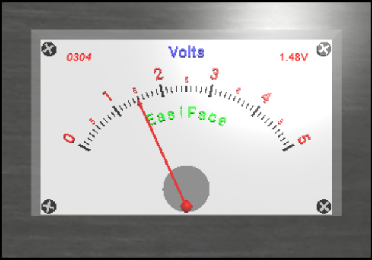
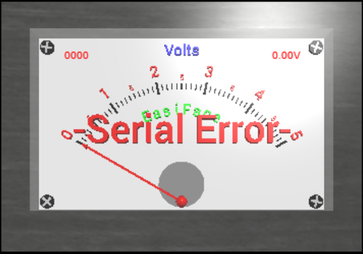

# TTB-AP-Lesson6
My Solution to Paul McWhorter's "Arduino with Python: LESSON 6" homework. 

Visit Paul's video here:
 - https://www.youtube.com/watch?v=61VKJ64Bdks

You can get Paul's code here (he does not seem to have posted anything for Lesson 6 yet):
 - https://toptechboy.com/using-an-arduino-with-python-lesson-5-analog-voltage-meter-in-vpython/

You can see my solution demonstrated here:
 - https://youtu.be/watch?v=h1DCbOOPD_k

## The serial connection is ok:

## The serial connection failed:

Enjoy!
